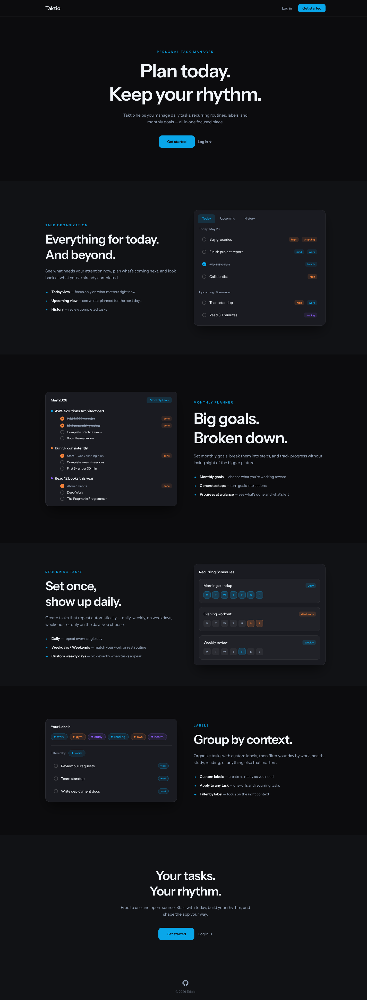
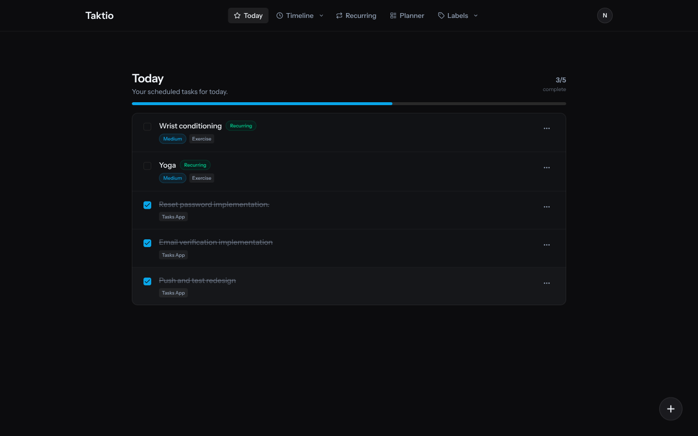
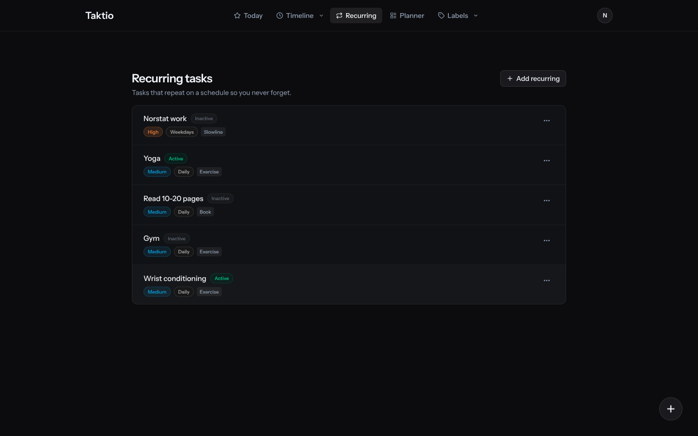
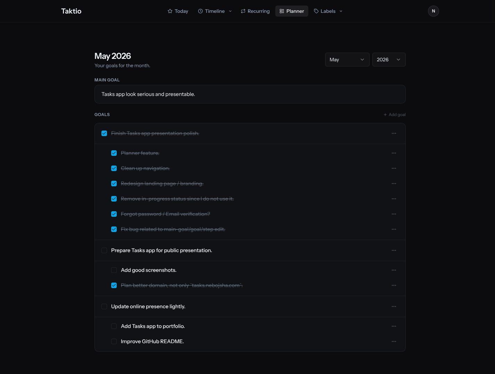
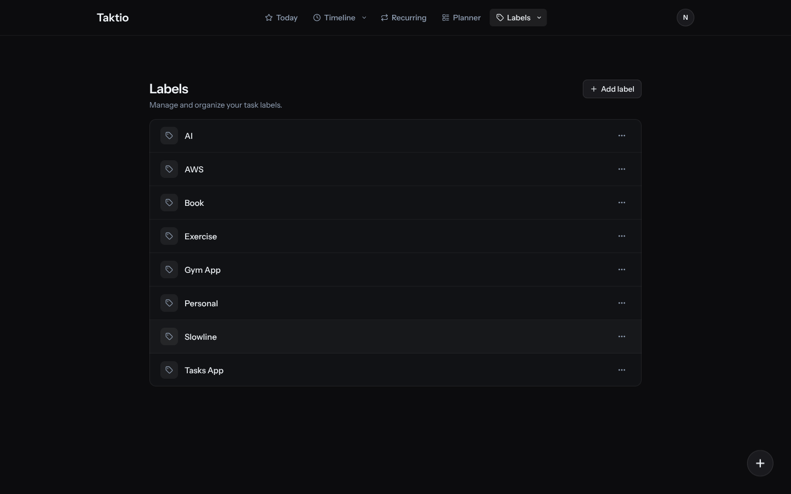

# Taktio

**Plan today. Keep your rhythm.**

Taktio is a personal task manager built around one idea: you shouldn't need to think about your system — only about your work. It handles your daily tasks, recurring routines, a week-ahead timeline, and monthly goals in one focused place.

→ **Live at [taktio.app](https://taktio.app/)**



---

## What is Taktio?

Most task apps are either too simple (a plain checklist) or too complex (a project management tool that ate too much). Taktio sits comfortably in between.

It gives you a clear **Today** view for what actually matters right now, a **Timeline** to see the next few days at a glance, **Recurring tasks** that show up automatically on their schedule, a **Planner** for setting and tracking monthly goals, and **Labels** to group everything by context.

There's no kanban board, no team workspace, no "synergy". Just your tasks, organised the way your brain works.

---

## Screenshots

### Today
Your scheduled tasks for the day, plus any recurring tasks due today. A progress bar at the top shows how you're tracking.



### Recurring tasks
Set once, show up on schedule. Define templates that repeat daily, weekdays only, weekends, or specific days of the week. Toggle them active or inactive without losing the template.



### Planner
A monthly planning board. Set a main goal for the month, break it into sub-goals, and track progress with individual steps. Navigating past months is read-only; the current month is fully editable.



### Labels
User-defined tags that apply to both tasks and recurring templates. Click a label to filter down to everything tagged with it.



---

## Features

- **Today view** — all tasks for today, including virtual recurring tasks due today; progress bar + completion count
- **Timeline** — next 7 days grouped by date; mix of one-off and recurring tasks
- **History** — past tasks grouped by date (completed and overdue)
- **Recurring task templates** — repeat daily, weekdays, weekends, or weekly on specific days; active/inactive toggle; labels and priority
- **Virtual task generation** — recurring tasks are computed in-memory and only written to the database on first interaction (no DB clutter from untouched templates)
- **Monthly planner** — one main goal per month, any number of sub-goals, each with step-by-step breakdowns
- **Labels** — create your own tags, apply them to tasks and recurring templates, filter by them
- **Priority levels** — Low / Medium / High on every task and template
- **Settings** — profile management, password change, appearance (theme), two-factor authentication
- **Fully user-scoped** — every resource is private; policies enforce that users only ever see their own data

---

## Tech stack

| Layer | What |
|---|---|
| Backend | [Laravel 12](https://laravel.com/) |
| Frontend bridge | [Inertia.js](https://inertiajs.com/) — SPA feel, no separate API |
| Frontend | [Vue 3](https://vuejs.org/) + TypeScript |
| Styling | [Tailwind CSS v4](https://tailwindcss.com/) |
| Build tool | [Vite 7](https://vitejs.dev/) |
| UI components | [Reka UI](https://reka-ui.com/) — headless primitives, shadcn-style |
| Authentication | [Laravel Fortify](https://laravel.com/docs/fortify) — login, registration, 2FA, email verification |
| Type-safe routes | [Laravel Wayfinder](https://github.com/laravel/wayfinder) — auto-generates URL helpers from controllers |
| Testing | PHPUnit 11 |
| Deployment | Docker (multi-stage build), GitHub Container Registry, EC2 |
| CI/CD | GitHub Actions — lint → test → deploy pipeline |
| Email | AWS SES |

---

## Local setup

**Requirements:** PHP 8.2+, Node.js 22+, Composer 2. SQLite is used by default (MySQL and PostgreSQL are also supported).

```bash
git clone https://github.com/your-username/taktio.git
cd taktio

# Install all dependencies, generate app key, run migrations, build assets
composer run setup

# Start the development server (Laravel + queue + log watcher + Vite hot reload)
composer run dev
```

Open [http://localhost:8000](http://localhost:8000) and register an account.

> For local development, set `MAIL_MAILER=log` in `.env` to skip email verification and see sent emails in `storage/logs/laravel.log` instead.

### Environment

Copy `.env.example` to `.env` before running setup. The defaults work out of the box for local development with SQLite. For production you'll want to configure:

- `DB_CONNECTION`, `DB_HOST`, etc. for MySQL or PostgreSQL
- `MAIL_MAILER=ses` with AWS credentials for transactional email
- A strong `APP_KEY` (generated automatically by setup)

---

## Development commands

```bash
# Development
composer run dev         # Laravel server + queue listener + log watcher + Vite
composer run dev:ssr     # Same with SSR support

# Testing
composer run test        # PHPUnit with in-memory SQLite + database refresh
php artisan test --filter=ClassName           # Single test class
php artisan test --filter=ClassName::method   # Single test method

# Code quality
vendor/bin/pint          # Fix PHP code style (Laravel Pint)
npm run lint             # Lint + fix Vue/TS with ESLint
npm run format           # Format frontend with Prettier
npm run format:check     # Check format without changing files

# Building
npm run build            # Production build
npm run build:ssr        # Build with SSR support
```

---

## Project structure

```
app/
├── Enums/              # TaskPriorityEnum, TaskRecurEnum, WeekdayEnum
├── Http/
│   ├── Controllers/    # TaskController, RecurringTaskTemplateController,
│   │                   # PlanController, PlanGoalController, PlanGoalStepController,
│   │                   # LabelController, Settings/*
│   └── Requests/       # Form request validation for each resource
├── Models/             # Task, RecurringTaskTemplate, RecurringTaskTemplatePeriod,
│   │                   # RecurringTaskTemplateWeekday, Label, MonthPlan, PlanGoal,
│   │                   # PlanGoalStep, User
└── Policies/           # User-scoped authorization for every resource

resources/js/
├── pages/              # Inertia page components
│   ├── tasks/          # Today.vue, Upcoming.vue, History.vue
│   ├── recurring/      # Recurring.vue
│   ├── plan/           # Plan.vue
│   ├── labels/         # Labels.vue, ShowLabel.vue
│   ├── settings/       # Profile, Password, Appearance, TwoFactor
│   └── auth/           # Login, Register, ForgotPassword, etc.
├── components/
│   ├── ui/             # Headless Reka UI wrappers (generated; rarely edited)
│   ├── ui-custom/      # Project-specific primitives (StatusBadge, TooltipButton, …)
│   └── tasks|labels|recurring-task-templates/
├── composables/        # useTaskDialog, useLabelDialog, useRecurringTemplateDialog, …
├── types/              # TypeScript interfaces mirroring backend models
├── enums/              # Frontend copies of PHP enums (must stay in sync)
├── actions/            # Auto-generated by Wayfinder — do not edit manually
└── routes/             # Auto-generated by Wayfinder — do not edit manually

routes/
├── tasks.php           # /today, /upcoming, /history, task CRUD
├── recurring.php       # /recurring, template CRUD, toggle
├── plan.php            # /plan/{year}/{month}, goals, steps
├── labels.php          # /labels, label CRUD
└── settings.php        # Profile, password, appearance, 2FA

tests/
├── Feature/            # HTTP + authorization tests
└── Unit/Models/        # Model logic tests (recurrence, virtual tasks, …)

.github/workflows/
├── tests.yml           # Run PHPUnit on push/PR
├── lint.yml            # Pint + ESLint + Prettier on push/PR
└── deploy.yml          # Build Docker image → push to GHCR → deploy to EC2
```

### How recurring tasks work

Recurring templates define a schedule (daily, weekdays, weekends, or specific weekdays) and a set of *periods* — date ranges during which they're active. A template with no `end_date` on its latest period is considered active.

Templates are never pre-stored as individual task rows. Until you interact with one, it's *virtual* — computed in-memory when you load the Today or Timeline pages. The moment you check one off (or edit it), it gets materialised into the database using `firstOrCreate`, preventing duplicates. This keeps the database clean without losing any history.

---


## A personal note

Taktio started as a tool I built for myself because I wanted something that matched how I actually think about my days — not a project tracker, not a Notion clone, just a clean place to keep tasks and routines in order.

---

<p align="center">
  Built with care by <a href="https://github.com/nebbo">Nebojsha Mitikj</a>
</p>
